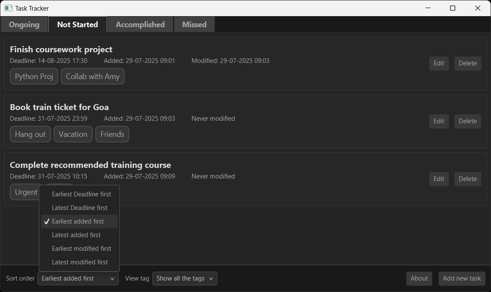
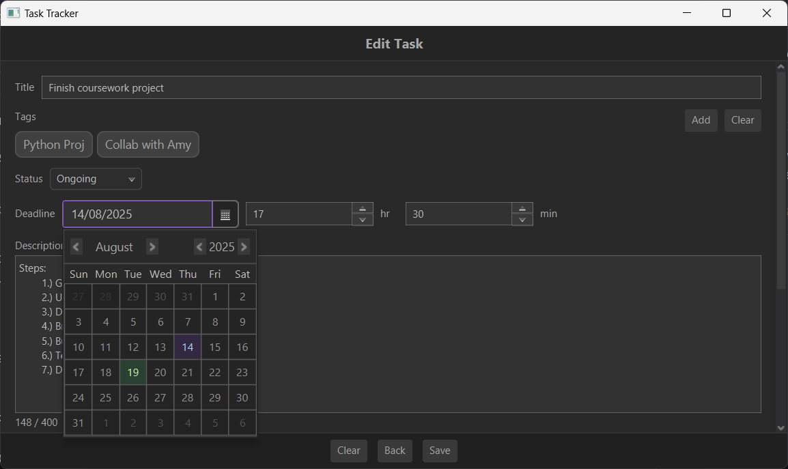

# 📝 Task Tracker – Minimalistic Desktop To-Do Manager

      

**Task Tracker** is a powerful and user-friendly desktop application built in Java to help you track, manage, and organize your daily tasks efficiently. It goes beyond traditional to-do lists by supporting tagging, smart filtering, status grouping, and deadline tracking — all wrapped in a clean and intuitive UI.

> 🔹 **Built for Windows** – Fully compatible for all 64-bit architecture ranging from **Windows 7 to Windows 11**  
> 🔹 **Native Experience** – Packaged as a `.exe` application.

## ✨ Features

- **Smart Organization**
  - Group tasks based on their **status** (Yet to start / Ongoing / Accomplished)
  - **Filter tasks** by tags
  - **Sort tasks** by:
    - Time added
    - Recently modified
    - Upcoming deadline
    ### Ordering Tasks
    

- **Intuitive UI**
  - Clean and simple interface that **prioritizes usability**.
  - **Optimized** and structured to **run effectively** on Windows OS.
  ### Edit Task Form
  

- **Lightweight & Fast**
  - **Minimal abstraction** and **no** use of **third party** libraries for developing UI.
  - Uses **HyperSQL (HSQLDB)** as an embedded database for local persistence.
  - Userdata is handled and stored **securely** - with **encryption** on database level.

## 📦 Installation

The application is bundled as a native Windows executable and installer:

1. Download the latest installer from [Releases](https://github.com/sujit-t-k/task-tracker/releases).
2. Run the `Task Tracker - Setup.exe` installer.
3. Follow the installation wizard and launch the app!

> ⚠️ Note: No Java installation is required — everything is bundled.

## 💡 Motivation

Hi, I’m **Sujit** — I created this task tracker out of personal necessity. I often found myself struggling to manage and follow up on tasks effectively. After exploring various tools available in the market, I realized most of them were either too complex, overloaded with features, or lacked the core functionality I truly needed.

So, I decided to build my own — a **minimalistic** yet powerful task tracker that focuses on simplicity while still offering all the **essential features** to **stay organized** and in control.

Feel free to reach out or contribute to the project!

## 🛠️ Tech Stack

- **Language:** Java
- **UI Framework:** OpenJFX (JavaFX)
- **Project Management and Build Tool:** Maven 
- **Database:** HyperSQL (HSQLDB)  
- **Styling:** CSS  
- **Packaging Tools:** Launch4j, Inno Setup

## 🚀 Getting Started (For Developers)

1. Clone the repository:
   ```bash
   git clone https://github.com/sujit-t-k/task-tracker.git
   cd task-tracker
   
2. Open the project in IntelliJ IDEA IDE preferabaly, or any other IDE that supports Java application development.

3. Run the application:
- Ensure JDK 21+ is installed
- Main class: Launcher.java (entry point)
- Maven Build Tool, HyperSQLDB Embedded jar, JavaFX SDK and associated libraries should be properly configured.

## 🙌 Acknowledgements

- [OpenJFX](https://openjfx.io/) – for the UI framework
- [HSQLDB](http://hsqldb.org/) – for the embedded database solution
- [Maven](https://maven.apache.org/) - for simplifying build process and managing project dependencies
- [Launch4j](http://launch4j.sourceforge.net/) – for wrapping the JAR into a native Windows executable
- [Inno Setup](https://jrsoftware.org/isinfo.php) – for creating a professional Windows installer

## 📃 License

This project is licensed under the [GNU General Public License v3.0 (GPL-3.0)](https://www.gnu.org/licenses/gpl-3.0.en.html).  
You are free to use, modify, and distribute this software, provided that any derivative work is also open-sourced and distributed under the same license.
